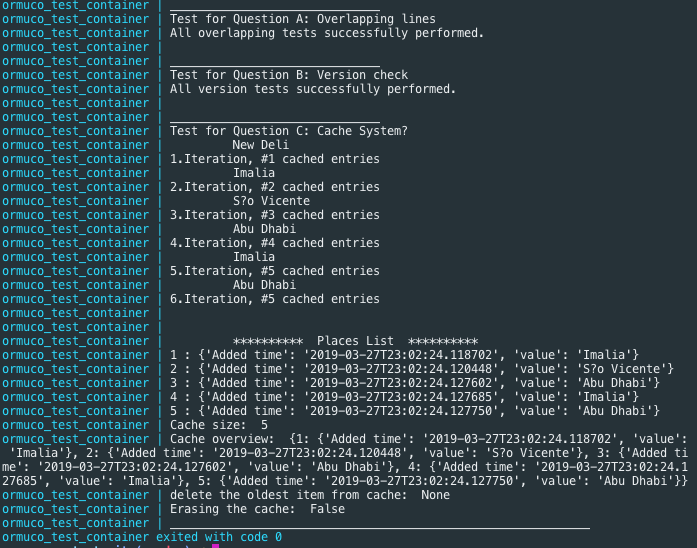

#First considerations! Read this first!


To run this test you **need docker installed 
or if you want run without it is your choice, 
but the docker it'll avoid you the
 obrigation to have python installed on your local machine and properly configured to run.**


Vist the docker page for more information -> [Docker](https://www.docker.com/get-started).


Independent of you are using docker or not after you can simple run all the scripts and test cases using the ***shell script command**
 inside the reposition.
 
 To run using shell script (**atettion to do this step you need docker installed on your local machie**):
 
````
sh start.sh
````

If you choose to not use the [docker](https://www.docker.com/get-started) you can run the scripts manullay by:
```
python test.py
```

Usually in unix like system the default `python` is the version 2 if you checkout the `Dockerfile` 
in the root the version I'm using is 3 (that's why I recommend to use 
the [docker](https://www.docker.com/get-started) to avoid problems).

But if you want to install manually  the `python3` on your 
machine and run manually the tests, usually when we have 2 versions of python
 in the same machine the right command is:
 ```
 python3 <file>.py
 ```
 
 In our case it'll be (if you have both installed):
 ```
 python3 test.py
 ```
 
 
 If you use [docker](https://www.docker.com/get-started) to run 
 this repo usally your output it'll be something like this:




#TECHNICAL TEST 

###Question A
Your goal for this question is to write a program that accepts two lines (x1,x2) and (x3,x4) on the x-axis and returns whether they overlap. As an example, (1,5) and (2,6) overlaps but not (1,5) and (6,8).

#####Checkout the file:
```
overlap.py
```
 
###Question B
The goal of this question is to write a software library that accepts 2 version string as input and returns whether one is greater than, equal, or less than the other. As an example: “1.2” is greater than “1.1”. Please provide all test cases you could think of.
#####Checkout the file:
```
version_check.py
```
 

###Question C
At Ormuco, we want to optimize every bits of software we write. Your goal is to write a new library that can be integrated to the Ormuco stack. Dealing with network issues everyday, latency is our biggest problem. Thus, your challenge is to write a new Geo Distributed LRU (Least Recently Used) cache with time expiration. This library will be used extensively by many of our services so it needs to meet the following criteria:
 
    1 - Simplicity. Integration needs to be dead simple.
    2 - Resilient to network failures or crashes.
    3 - Near real time replication of data across Geolocation. Writes need to be in real time.
    4 - Data consistency across regions
    5 - Locality of reference, data should almost always be available from the closest region
    6 - Flexible Schema
    7 - Cache can expire 


#####I didn't understand this question so I create out a default cache where you can for any situation.

#####Checkout the file:
```
cache.py
```


As a hint, we are not looking for quantity, but rather quality, maintainability, scalability, testability and a code that you can be proud of. 
When submitting your code add the necessary documentation to explain your overall design and missing functionalities.  Do it to the best of your knowledge.
 
Good Luck, you can write it in the language of your choice, name the test using the convention firstname_lastname_test and provide a link in your personal github so we can review the work.

